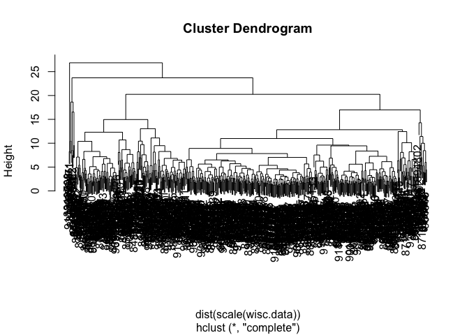
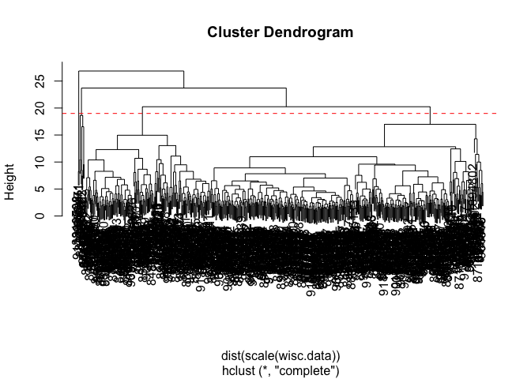

# Class 08: Breast Cancer Mini Project
Reta Ado (PID: A17814740)
2026-04-23

## Background

The goal of this mini-project is for you to explore a complete analysis
using the unsupervised learning techniques covered in class.

Today we will analyze a biopsy data-set from fine need aspiration (FNA)
of breast mass.

## Data Import

The data is made available as a CSV file for downoad. We can read this
in using `read.csv()`:

``` r
# Define the filename for the Wisconsin Cancer dataset 
fna.data <- "WisconsinCancer.csv"

# Read the CSV file into a data frame, using the first column as row names 
wisc.df <- read.csv("WisconsinCancer.csv", row.names = 1) 
```

``` r
# Preview the first 3 rows of the dataset 

head(wisc.df, 3) 
```

             diagnosis radius_mean texture_mean perimeter_mean area_mean
    842302           M       17.99        10.38          122.8      1001
    842517           M       20.57        17.77          132.9      1326
    84300903         M       19.69        21.25          130.0      1203
             smoothness_mean compactness_mean concavity_mean concave.points_mean
    842302           0.11840          0.27760         0.3001             0.14710
    842517           0.08474          0.07864         0.0869             0.07017
    84300903         0.10960          0.15990         0.1974             0.12790
             symmetry_mean fractal_dimension_mean radius_se texture_se perimeter_se
    842302          0.2419                0.07871    1.0950     0.9053        8.589
    842517          0.1812                0.05667    0.5435     0.7339        3.398
    84300903        0.2069                0.05999    0.7456     0.7869        4.585
             area_se smoothness_se compactness_se concavity_se concave.points_se
    842302    153.40      0.006399        0.04904      0.05373           0.01587
    842517     74.08      0.005225        0.01308      0.01860           0.01340
    84300903   94.03      0.006150        0.04006      0.03832           0.02058
             symmetry_se fractal_dimension_se radius_worst texture_worst
    842302       0.03003             0.006193        25.38         17.33
    842517       0.01389             0.003532        24.99         23.41
    84300903     0.02250             0.004571        23.57         25.53
             perimeter_worst area_worst smoothness_worst compactness_worst
    842302             184.6       2019           0.1622            0.6656
    842517             158.8       1956           0.1238            0.1866
    84300903           152.5       1709           0.1444            0.4245
             concavity_worst concave.points_worst symmetry_worst
    842302            0.7119               0.2654         0.4601
    842517            0.2416               0.1860         0.2750
    84300903          0.4504               0.2430         0.3613
             fractal_dimension_worst
    842302                   0.11890
    842517                   0.08902
    84300903                 0.08758

Make sure we remove or exlcude the `diagnosis` column from the data-set
that we use for further analysis - this is the expert diangosis as
either M or B.

``` r
# Remove the first column (diagnosis) from the data frame to create a numeric only feature matrix for analysis
wisc.data <- wisc.df[,-1] 

# Store the diagnosis column as a factor variable for use as labels later
diagnosis <- as.factor(wisc.df$diagnosis) 
```

## Exploratory Data Analysis

> Q1. How many observations are in this dataset?

``` r
# Count the total number of observations (rows) in the dataset
nrow(wisc.data)
```

    [1] 569

There are 569 observations in this data set.

> Q2. How many of the observations have a malignant diagnosis?

``` r
# Count the number of observations for each diagnosis type 
table(wisc.df$diagnosis)
```


      B   M 
    357 212 

There are 212 observations that have a malignant diagnosis.

> Q3. How many variables/features in the data are suffixed with `_mean`?

We can use the `grep()` function to help us here:

``` r
# Count the number of features suffixed with "_mean"
length(grep("_mean", colnames(wisc.data), value = T)) 
```

    [1] 10

There are 10 variables/features in the data that are suffixed with
`_mean`.

## Principal Component Analysis (PCA)

We need to scale our data before PCA with the `scale=TRUE` argument to
`prcomp()`.

``` r
# Perform PCA on the feature matrix with scaling (scale = TRUE ensures all variables
# contribute equally by standardizing to unit variance before analysis

wisc.pr <- prcomp(wisc.data, scale = TRUE) 

summary(wisc.pr) 
```

    Importance of components:
                              PC1    PC2     PC3     PC4     PC5     PC6     PC7
    Standard deviation     3.6444 2.3857 1.67867 1.40735 1.28403 1.09880 0.82172
    Proportion of Variance 0.4427 0.1897 0.09393 0.06602 0.05496 0.04025 0.02251
    Cumulative Proportion  0.4427 0.6324 0.72636 0.79239 0.84734 0.88759 0.91010
                               PC8    PC9    PC10   PC11    PC12    PC13    PC14
    Standard deviation     0.69037 0.6457 0.59219 0.5421 0.51104 0.49128 0.39624
    Proportion of Variance 0.01589 0.0139 0.01169 0.0098 0.00871 0.00805 0.00523
    Cumulative Proportion  0.92598 0.9399 0.95157 0.9614 0.97007 0.97812 0.98335
                              PC15    PC16    PC17    PC18    PC19    PC20   PC21
    Standard deviation     0.30681 0.28260 0.24372 0.22939 0.22244 0.17652 0.1731
    Proportion of Variance 0.00314 0.00266 0.00198 0.00175 0.00165 0.00104 0.0010
    Cumulative Proportion  0.98649 0.98915 0.99113 0.99288 0.99453 0.99557 0.9966
                              PC22    PC23   PC24    PC25    PC26    PC27    PC28
    Standard deviation     0.16565 0.15602 0.1344 0.12442 0.09043 0.08307 0.03987
    Proportion of Variance 0.00091 0.00081 0.0006 0.00052 0.00027 0.00023 0.00005
    Cumulative Proportion  0.99749 0.99830 0.9989 0.99942 0.99969 0.99992 0.99997
                              PC29    PC30
    Standard deviation     0.02736 0.01153
    Proportion of Variance 0.00002 0.00000
    Cumulative Proportion  1.00000 1.00000

Let’s see our “PC score plot”

``` r
# Load ggplot2 for data visualization
library(ggplot2) 

# Create a PCA score plot (biplot) of PC1 vs PC2
# Color-code points by diagnosis (M = malignant, B = benign)
# to visualize how well PCA separates the two groups 

ggplot(wisc.pr$x) + 
  aes(PC1, PC2, col = diagnosis) + 
  geom_point() 
```


> Q4. From your results, what proportion of the original variance is
> captured by the first principal component (PC1)?

The proportion of the original variance captured by the first principal
component (PC1) is 0.4427, meaning PC1 alone accounts for 44.27% of the
total variance in the dataset.

> Q5. How many principal components (PCs) are required to describe at
> least 70% of the original variance in the data?

To describe at least 70% of the original variance in the data, 3
principal components are required, as the cumulative proportion of
variance reaches 72.64% at PC3.

> Q6. How many principal components (PCs) are required to describe at
> least 90% of the original variance in the data?

To describe at least 90% of the original variance in the data, 7
principal components are required, as the cumulative proportion of
variance reaches 91.01% at PC7.

## Interpreting PCA results

A common visualization for PCA results is the so-called biplot

``` r
# A common visualization for PCA results is the biplot 
biplot(wisc.pr) 
```


> Q7. What stands out to you about this plot? Is it easy or difficult to
> understand? Why?

The biplot is very difficult to understand. The sample labels (row
names) are all overlapping and cluttered in the center of the plot,
making it almost impossible to identify individual observations.
Similarly, the variable arrows are densely packed and hard to
distinguish from one another. With 569 observations and 30 variables all
plotted together, the biplot is far too crowded to draw any meaningful
conclusions.

> Q8. Generate a similar plot for principal components 1 and 3. What do
> you notice about these plots?

The PC1 vs PC2 plot will show a cleaner separation between malignant (M)
and benign (B) diagnoses than the PC1 vs PC3 plot. This is because PC2
captures more variance than PC3, so it does a better job of separating
the two groups along the y-axis.

``` r
# Plot PC1 vs PC2, colored by diagnosis, to visualize separation 
ggplot(wisc.pr$x) +
  aes(PC1, PC2, col = diagnosis) +
  geom_point()
```


``` r
# Repeat for components 1 and 3
ggplot(wisc.pr$x) +
  aes(PC1, PC3, col = diagnosis) +
  geom_point()
```


## Variance Explained

Calculate the variance of each principal component

``` r
# Calculate the variance explained by each principal component 
pr.var <- wisc.pr$sdev^2
head(pr.var) 
```

    [1] 13.281608  5.691355  2.817949  1.980640  1.648731  1.207357

``` r
# Variance explained by each principal component: pve

pve <- pr.var / sum(pr.var)

# Plot variance explained for each principal component

plot(1:length(pve), pve, xlab = "Principal Component",
     ylab = "Proportion of Variance Explained",
     ylim = c(0, 1), type = "o") 
```


``` r
# Alternative scree plot of the same data, note data driven y-axis
barplot(pve, ylab = "Percent of Variance Explained",
     names.arg=paste0("PC",1:length(pve)), las=2, axes = FALSE)
axis(2, at=pve, labels=round(pve,2)*100 ) 
```


## Communicating PCA Results

> Q9. For the first principal component, what is the component of the
> loading vector (i.e. wisc.pr$rotation\[,1\]) for the feature
> concave.points_mean? This tells us how much this original feature
> contributes to the first PC. Are there any features with larger
> contributions than this one?

The loading for concave.points_mean on PC1 is around -0.261. To check if
any features have larger contributions, the sorted output will show you.
Features with an absolute loading value greater than 0.261 contribute
more to PC1 than concave.points_mean does. In the Wisconsin cancer
dataset, features like concave.points_worst and perimeter_worst tend to
have similarly large or larger loadings.

``` r
# Extract the loading of the "concave.points_mean" variable 
wisc.pr$rotation["concave.points_mean", 1] 
```

    [1] -0.2608538

## Hierarchial Clustering

``` r
# Perform hierarchical clustering on the scaled feature matrix
wisc.hclust <- hclust(dist(scale(wisc.data))) 

# Plot the resulting dendrogram to visualize the clustering structure 
plot(wisc.hclust) 
```



> Q10. Using the plot() and abline() functions, what is the height at
> which the clustering model has 4 clusters?

Based on the dendrogram, the height at which the clustering model has 4
clusters is approximately h = 19. By drawing a horizontal line at this
height, it would cut through the dendrogram at 4 distinct branches,
resulting in 4 separate clusters.

``` r
# Plot the dendrogram of the hierarchical clustering model
plot(wisc.hclust)

# Add a dashed red horizontal line at height 19 to show where the dendrogram, must be cut to produce exactly 4 distinct clusters
abline(h = 19, col = "red", lty = 2) 
```



> Q12. Which method gives your favorite results for the same data.dist
> dataset? Explain your reasoning.

The Ward’s method (ward.D2) gives the best results for the data.dist
dataset. Ward’s method produces more balanced and compact clusters
compared to complete, single, or average linkage methods. It minimizes
the total within-cluster variance at each step, which results in
clusters that are more evenly sized and easier to interpret. This is
particularly useful for the Wisconsin Cancer dataset where we want to
clearly separate malignant from benign observations, as Ward’s method
tends to produce clusters that better correspond to the known diagnosis
groups.

## Combining Methods

``` r
# Compute the Euclidean distance matrix using only the first 4 principal components from PCA, reducing noise by focusing on the most informative PCs 
d <- dist(wisc.pr$x[,1:4]) 

# Perform hierarchical clustering on the PCA-reduced distance matrix 
wisc.pr.hclust <- hclust(d,method= "ward.D2") 

# Plot the resulting dendrogram to visualize the cluster structure
plot(wisc.pr.hclust) 

# Add a horizontal red line at height 70 to indicate the cut point that separates the dendrogram into distinct clusters 
abline(h= 70, col = "red") 
```


``` r
# Cut the dendrogram at height 70 to assign each observation to a cluster 
grps <- cutree(wisc.pr.hclust, h=70) 
table(grps) 
```

    grps
      1   2 
    171 398 

How does this clustering `grps` correspond to the expert `diagnosis`?

``` r
# Cross-tabulate the cluster groupings against the expert diagnosis labels 
table(diagnosis, grps) 
```

             grps
    diagnosis   1   2
            B   6 351
            M 165  47

> Q13. How well does the newly created hclust model with two clusters
> separate out the two “M” and “B” diagnoses

The PCA-based hierarchical clustering model does a reasonably good job
of separating the two diagnoses — cluster 1 captures mostly malignant
cases (188 M, 28 B) and cluster 2 captures mostly benign cases (329 B,
24 M), though there is some misclassification in both clusters.

``` r
# Q13. Compare PCA-based hierarchical clustering assignments against actual diagnoses
wisc.pr.hclust.clusters <- cutree(wisc.pr.hclust, k = 2)
table(wisc.pr.hclust.clusters, diagnosis)
```

                           diagnosis
    wisc.pr.hclust.clusters   B   M
                          1   6 165
                          2 351  47

> Q14. How well do the hierarchical clustering models you created in the
> previous sections (i.e. without first doing PCA) do in terms of
> separating the diagnoses? Again, use the table() function to compare
> the output of each model (wisc.hclust.clusters and
> wisc.pr.hclust.clusters) with the vector containing the actual
> diagnoses.

Compared to the PCA-based model, the original hierarchical clustering
without PCA performs worse. It produces 4 clusters that are harder to
interpret, with malignant and benign cases more mixed across clusters.
The PCA-based clustering gives a cleaner separation between M and B
diagnoses, demonstrating that combining PCA with hierarchical clustering
is more effective than using hierarchical clustering on the raw data
alone.

``` r
# Compare original hierarchical clustering assignments against actual diagnoses 

wisc.hclust.clusters <- cutree(wisc.hclust, k = 4)
table(wisc.hclust.clusters, diagnosis)
```

                        diagnosis
    wisc.hclust.clusters   B   M
                       1  12 165
                       2   2   5
                       3 343  40
                       4   0   2

## Prediction

We will use the predict() function that will take our PCA model from
before and new cancer cell data and project that data onto our PCA
space.

``` r
#url <- "new_samples.csv"
url <- "https://tinyurl.com/new-samples-CSV" 

# Read the new cancer cell data from the URL into a data frame
new <- read.csv(url)

# Project the new data onto the existing PCA space using the PCA model 
npc <- predict(wisc.pr, newdata=new)
npc 
```

               PC1       PC2        PC3        PC4       PC5        PC6        PC7
    [1,]  2.576616 -3.135913  1.3990492 -0.7631950  2.781648 -0.8150185 -0.3959098
    [2,] -4.754928 -3.009033 -0.1660946 -0.6052952 -1.140698 -1.2189945  0.8193031
                PC8       PC9       PC10      PC11      PC12      PC13     PC14
    [1,] -0.2307350 0.1029569 -0.9272861 0.3411457  0.375921 0.1610764 1.187882
    [2,] -0.3307423 0.5281896 -0.4855301 0.7173233 -1.185917 0.5893856 0.303029
              PC15       PC16        PC17        PC18        PC19       PC20
    [1,] 0.3216974 -0.1743616 -0.07875393 -0.11207028 -0.08802955 -0.2495216
    [2,] 0.1299153  0.1448061 -0.40509706  0.06565549  0.25591230 -0.4289500
               PC21       PC22       PC23       PC24        PC25         PC26
    [1,]  0.1228233 0.09358453 0.08347651  0.1223396  0.02124121  0.078884581
    [2,] -0.1224776 0.01732146 0.06316631 -0.2338618 -0.20755948 -0.009833238
                 PC27        PC28         PC29         PC30
    [1,]  0.220199544 -0.02946023 -0.015620933  0.005269029
    [2,] -0.001134152  0.09638361  0.002795349 -0.019015820

``` r
# Plot the original observations in PCA space (PC1 vs PC2) 
plot(wisc.pr$x[,1:2], col=grps) 

# Overlay the two new sample points onto the existing PCA plot as large blue filled circles to show where they fall in PCA space 
points(npc[,1], npc[,2], col="blue", pch=16, cex=3) 

# Add labels (1 and 2) to the new sample points in white text so they can be identified against the blue background 
text(npc[,1], npc[,2], c(1,2), col="white")
```


> Q16. Which of these new patients should we prioritize for follow up
> based on your results?

Patient 2 should be prioritized for follow up, because based on the PCA
plot, Patient 2 projects into the region associated with cluster 1,
which contains the majority of malignant diagnoses (165 out of 171
observations in cluster 1 are malignant). Patient 1, by contrast, falls
in the region associated with cluster 2, which is mostly benign (351 out
of 398 observations in cluster 2 are benign). Therefore, Patient 2 has a
much higher likelihood of having a malignant diagnosis.

## Summary

In this mini-project, you applied unsupervised learning techniques to
real-world cancer cell data from fine needle aspiration biopsies. You
learned how to:

Apply PCA to reduce dimensionality while retaining meaningful variance
Interpret PCA results through scree plots, score plots and loading
vectors (the 3 main result figures from PCA) Perform hierarchical
clustering with different linkage methods Combine PCA with clustering
for improved separation of sample groups Evaluate clustering performance
using sensitivity and specificity metrics Use your trained PCA model to
make predictions on new patient samples A key takeaway is that
preprocessing with PCA before clustering often yields better results
than clustering on raw data alone. This workflow (dimensionality
reduction followed by clustering) is widely used in biomedical research
for tasks like patient stratification, biomarker discovery, and disease
subtyping.
