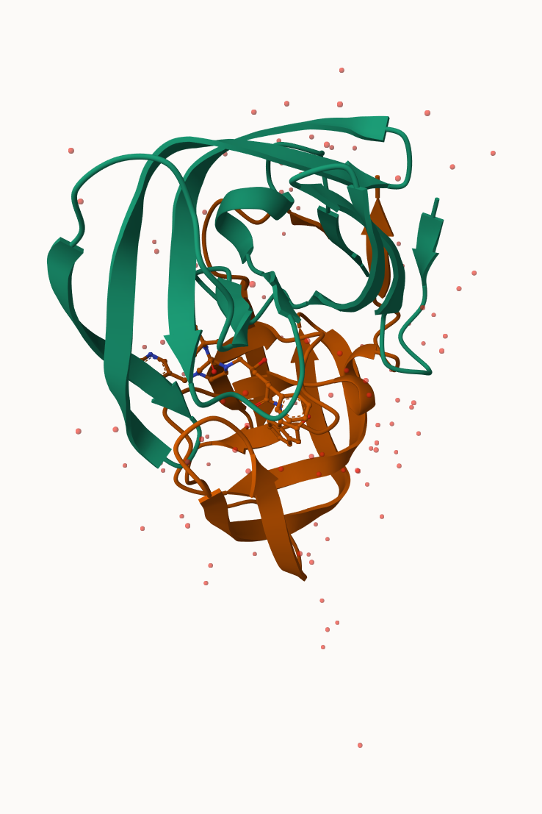
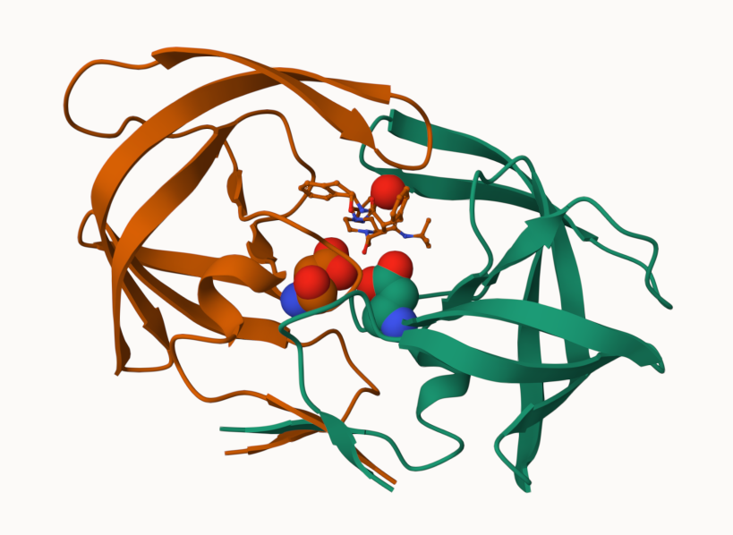
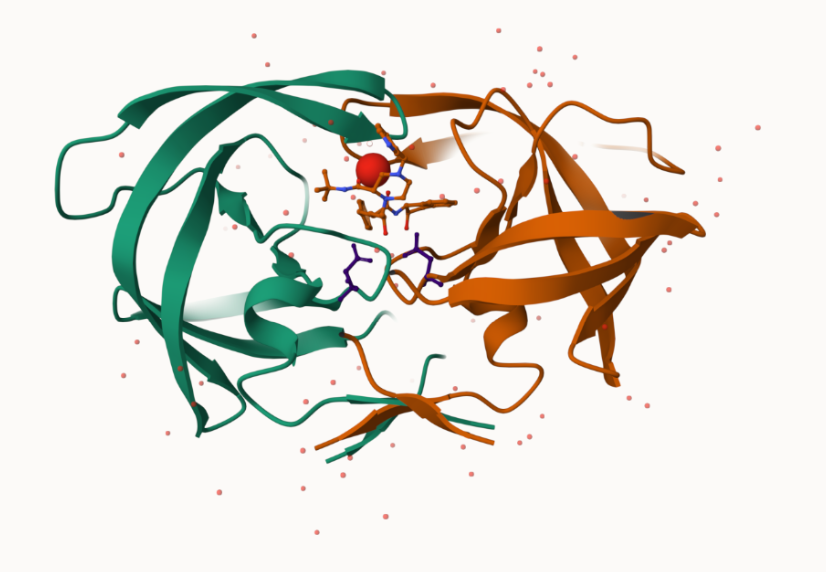

## Learning Objectives 

By the end of this lab, you will be able to:

- Navigate the PDB database and describe it’s biased composition statistics.
- Use Mol* to visualize protein-ligand interactions.
- Employ bio3d to read and analyze PDB structure data.
Use Normal Mode Analysis to predict protein furctional motions.
- Apply PCA to characterize protein conformational dynamics. 

## Introduction to the RCSB Protein Data Bank (PDB)

The PDB archive is the major repository of information about the 3D structures of large biological molecules, including proteins and nucleic acids. Understanding the shape of these molecules helps to understand how they work. This knowledge can be used to help deduce a structure’s role in human health and disease, and in drug development. The structures in the PDB range from tiny proteins and bits of DNA or RNA to complex molecular machines like the ribosome composed of many chains of protein and RNA.

In the first section of this lab we will interact with the main US based PDB website (note there are also sites in Europe and Japan).

Visit: http://www.rcsb.org/ and answer the following questions 

**PDB *Statistics** 

Read a CSV file of current PDB stats obtained from http://www.rcsb.org/stats/summary
```{r}

## Read the csv 
pdb <- read.csv("Data Export Summary.csv", row.names = 1) 
pdb 

```


```{r}
pdb$X.ray 
```

The print out above `pdb$X.ray` is "character" not "numeric". Therefore I can't do math with it. 


```{r} 

# We want to get rid (or sub out) commas: 

x <- pdb$X.ray 
tmp <- sub(",", "", x) 
sum(as.numeric(tmp)) 
```

We can make a function to do this: 

```{r}
# First define the rm.comma function
rm.comma <- function(x) {
  as.numeric(gsub(",", "", x))
}
```


> Q1: What percentage of structures in the PDB are solved by X-Ray and Electron Microscopy. 

The percentage of structures in the PDB that are solved by X-ray and Electron Microscopy is 80.48577% 13.38046%.  

```{r} 

# Then use it
n.tot <- rm.comma(pdb$Total)
n.xray <- rm.comma(pdb$X.ray) 
n.em <- rm.comma(pdb$EM) 

# Q1: Percentages 

sum(n.xray) / sum(n.tot) * 100
sum(n.em)   / sum(n.tot) * 100 
```


We could also use a different import function for this CSV that speaks American (i.e., deals with commas in numbers in a comma separated value file) 

```{r}

#install.packages("readr")
library(readr) 

 # Read the csv 
read_csv("Data Export Summary.csv") 
```


> Q2: What proportion of structures in the PDB are protein? 

The proportion of structures in the PDB that are protein is 0.9791868. 

```{r}

# Q2: Proportion of structures that are protein
n.tot <- rm.comma(pdb$Total)

sum(n.tot[1:3]) / sum(n.tot) 

```


**Key-point**: We have a very, very small structural coverage of knoen proteins (~0.1%). Most structures we know about (~80%) come from one method (X-ray crystalography). 

```{r}
217375/202556314 * 100 
```


> Q3: Type HIV in the PDB website search box on the home page and determine how many HIV-1 protease structures are in the current PDB?

There are 1227 structures of HIV-1 protease in the current PDB. 


**The PDB format** 

Now download the “PDB File” for the HIV-1 protease structure with the PDB identifier 1HSG. On the website you can “Display” the contents of this “PDB format” file.

Alternatively, you can examine the contents of your downloaded file in a suitable text editor or use the Terminal tab from within RStudio (or your favorite Terminal/Shell) and try the following command:


## Visualizing the HIV-1 protease structure 

The HIV-1 protease is an enzyme that is vital for the replication of HIV. It cleaves newly formed polypeptide chains at appropriate locations so that they form functional proteins. Hence, drugs that target this protein could be vital for suppressing viral replication. A handful of drugs - called HIV-1 protease inhibitors (saquinavir, ritonavir, indinavir, nelfinavir, etc.) - are currently commercially available that inhibit the function of this protein, by binding in the catalytic site that typically binds the polypeptide.

In this section we will use the 2Å resolution X-ray crystal structure of HIV-1 protease with a bound drug molecule indinavir (PDB ID: 1HSG). We will use the Mol* molecular viewer to visually inspect the protein, the binding site and the drug molecule. After exploring features of the complex we will move on to perform bioinformatics analysis of single and multiple crystallographic stuctures to explore the conformational dynamics and flexibility of the protein - important for it’s function and for considering during drug design.


**Using Mol** 

Main stand alone web version with all features is at https://molstar.org/viewer/. 

 

.png) 

 

> Q4: Water molecules normally have 3 atoms. Why do we see just one atom per water molecule in this structure? 

Water molecules normally have 3 atoms (1 oxygen + 2 hydrogens), but we only see one atom per water molecule in this structure because hydrogen atoms are invisible to X-ray crystallography. X-rays are scattered by electrons, and hydrogen has only 1 electron, which is far too few to produce a detectable signal. Only the oxygen atom of each water molecule has enough electrons to appear. 

> Q5: There is a critical “conserved” water molecule in the binding site. Can you identify this water molecule? What residue number does this water molecule have

The critical conserved water molecule is HOH 308. It is between the ligand and flap region (near Ile50) between both chains. 

> Q6: Generate and save a figure clearly showing the two distinct chains of HIV-protease along with the ligand. You might also consider showing the catalytic residues ASP 25 in each chain and the critical water (we recommend “Ball & Stick” for these side-chains). Add this figure to your Quarto document

 


## Reading PDB file data into R 

```{r}

#library(bio3d)
#library(bio3dview)

# Read the HIV-1 protease structure from the PDB database
#pdb <- read.pdb("1hsg")

# Select the active site residues (Asp25 in both chains)
#active.site <- bio3d::atom.select(pdb, resno = 25)

# Visualize the protein structure with the active site highlighted
#view.pdb(pdb,
       #  highlight = active.site,
        # cols = c("red", "blue"))
```


```{r}
pdb 
```

> Q7: How many amino acid residues are there in this pdb object? 

198 residues 

> Q8: Name one of the two non-protein residues? 

HOH or MK1 

> Q9: How many protein chains are in this structure? 
 
2 chains (A and B) 


## Predict the flexibility of a given structure 

Let's do a Normal Mode Analysis (NMA) to predict the flexibility of a given `pdb` object: 

```{r} 
#adk <- read.pdb("6s36") 
#adk 
```


```{r}
#m <- nma(adk) 
#plot(m) 
```


```{r}
#library(bio3dview)
#view.nma(m) 
```


Write out the results for viewing in Mol-star: 

```{r}
#mktrj(m, file = "nma.pdb") 
```


## Comparative analysis of the ADK family 

Our first step is to find a sequence for this family. We will use the database ID "1ake_A" here. 

```{r}
#install.packages("pak")
#pak::pkg_install("bioc::XVector")
#pak::pkg_install("bioc::Biostrings")
#pak::pkg_install("bioc::msa") 
```


> Q10. Which of the packages above is found only on BioConductor and not CRAN? 

The package msa is found only on BioConductor and not CRAN. 

> Q11. Which of the above packages is not found on BioConductor or CRAN?: 

The bio3dview package is not found in BioConductor or CRAN. 

> Q12. True or False? Functions from the pak package can be used to install packages from GitHub and BitBucket?

True. 


```{r}
#install.packages("httr")
library(bio3d)

id <- "1ake_A" 

aa <- get.seq(id) 
aa 
```

> Q13. How many amino acids are in this sequence, i.e. how long is this sequence? 

214 amino acids 

Search for related sequences in the database. 

```{r}
# blast <- blast.pdb(aa) 

```


```{r}
#head(blast$hit.tbl) 
```


```{r}
#hits <- plot(blast) 
```


```{r}
#hits$pdb.id 
```

```{r}
#files <- get.pdb(hits$pdb.id, path="pdbs", split=TRUE, gzip=TRUE) 
```

Align and supperpose all these ADK structures 

```{r}
# Align releated PDBs
#pdbs <- pdbaln(files, fit = TRUE, exefile="msa") 
```


Quick interactive structural view 

```{r}
# view.pdbs(pdbs) 
```

PCA of all this structural data (x, y, and z atom coordinates): 

```{r}
#pc <- pca(pdbs) 
#plot(pc) 
```


```{r}
#plot(pc, 1:2) 
```

Interactive view of the PC1 captured 

```{r}
#mktrj(pc, file = "pca.pdb") 
```

## PCA 

```{r}
# Perform PCA
#pc.xray <- pca(pdbs)
#plot(pc.xray) 
```

## PCA Visualization 

```{r}
# Visualize first principal component
#pc1 <- mktrj(pc.xray, pc=1, file="pc_1.pdb") 
```


```{r}

library(bio3d)
library(ggplot2)
library(ggrepel)

# 1. PCA
#pc.xray <- pca(pdbs)

# 2. RMSD-based clustering
#rd <- rmsd(pdbs, fit = TRUE)
#hc.rd <- hclust(as.dist(rd))
#grps.rd <- cutree(hc.rd, k = 3)

# 3. Get structure IDs for labels
#ids <- basename.pdb(pdbs$id)

# 4. Plot
#df <- data.frame(PC1 = pc.xray$z[,1],
               #  PC2 = pc.xray$z[,2],
                # col = as.factor(grps.rd),
                # ids = ids)

#p <- ggplot(df) +
#  aes(PC1, PC2, col = col, label = ids) +
# geom_point(size = 2) +
 # geom_text_repel(max.overlaps = 20) +
 # theme(legend.position = "none")
#p 
```


