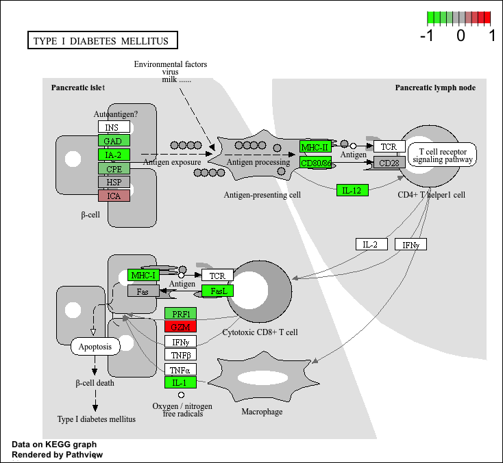

## Background 

Today we're going to do an RNA-seq analysis of a data set on the common glucocorticoid steriod dexamethasone (dex), and we'll use DESeq for this analysis. 


## Data Import 

Let's read the `count` data and `metadata` about this experiment setup from the supplied CSV files: 

```{r}
# Read the data from CSV files 

counts <- read.csv("airway_scaledcounts.csv", row.names=1)
metadata <- read.csv("airway_metadata.csv") 
```


```{r}
# Now, take a look at the head of counts 
head(counts) 
```

Here we have a wee peek: 
```{r}
# Now, take a look at the head of metadata 
head(metadata)
```
and the meta data that tells us what is actually in the columns of our `counts` object: 

> Q1. How many genes are in this dataset? 

There are 38694 genes in this data set. 

```{r}
# Count genes in data set 
nrow(counts) 
```

> Q2. How many ‘control’ cell lines do we have? 

There are 4 'control' cell lines. 

```{r}
# Control cell lines 
sum(metadata$dex == "control") 
```

- Find the "control" columns in our `counts` object 
- Extract just the "control" column values for all genes 
- Calculate the average value per gene in these "control" columns 

```{r}
control.inds <- metadata$dex == "control" 
control.counts <- counts[ , control.inds ] 
control.mean <- rowMeans(control.counts) 
```

```{r}
head(control.mean) 
```


## Toy differential gene expression 

Calculate the mean counts per gene across these samples: 

```{r}
# Mean counts per gene 
control <- metadata[metadata[,"dex"]=="control",]
control.counts <- counts[ ,control$id]
control.mean <- rowSums( control.counts )/4 
head(control.mean) 
```

Side-note: An alternative way to do this same thing using the dplyr package from the tidyverse is shown below. 

```{r} 
library(dplyr)
control <- metadata %>% filter(dex=="control")
control.counts <- counts %>% select(control$id) 
control.mean <- rowSums(control.counts)/4
head(control.mean) 
```
> Q3. How would you make the above code in either approach more robust? Is there a function that could help here? 
 
The hardcoded `/4` is the problem. If more samples were added, the mean would be wrong. The more robust solution is rowMeans(). 

```{r}
# Base R robust version
control.inds <- metadata$dex == "control" 
control.counts <- counts[ , control.inds ] 
control.mean <- rowMeans(control.counts) 

head(control.mean) 

# dplyr robust version (same idea) 
control.mean <- rowMeans(control.counts)
```
> Q4. Follow the same procedure for the treated samples (i.e. calculate the mean per gene across drug treated samples and assign to a labeled vector called treated.mean) 

Answer below: 

```{r}
# Base R
treated.mean <- rowMeans(counts[,metadata$dex == "treated"]) 
head(treated.mean) 

```

We will combine our meancount data for bookkeeping purposes: 

```{r}
meancounts <- data.frame(control.mean, treated.mean) 
```

> Q5 (a). Create a scatter plot showing the mean of the treated samples against the mean of the control samples. Your plot should look something like the following. 

```{r}
plot(meancounts) 
```

Our count data is highly skewed 

> Q5 (b).You could also use the ggplot2 package to make this figure producing the plot below. What geom_?() function would you use for this plot? 

The geom_() function you would use is geom_point(). 

```{r}
library(ggplot2)

ggplot(meancounts, aes(x=control.mean, y=treated.mean)) +
  geom_point() 
```


> Q6. Try plotting both axes on a log scale. What is the argument to plot() that allows you to do this? 

The argument is `log="xy"`. 

```{r}
plot(meancounts, log = "xy") 
```

We often use log2 transform for this kind of data in bioinformatics because it makes my brain hurt less 

Here we calculate log2foldchange, add it to our meancounts data.frame and inspect the results either with the head() or the View() function for example. 

```{r}
meancounts$log2fc <- log2(meancounts[,"treated.mean"]/meancounts[,"control.mean"])
head(meancounts) 
```


There are a couple of “weird” results. Namely, the NaN (“not a number”) and -Inf (negative infinity) results.

The NaN is returned when you divide by zero and try to take the log. The -Inf is returned when you try to take the log of zero. It turns out that there are a lot of genes with zero expression. Let’s filter our data to remove these genes. Again inspect your result (and the intermediate steps) to see if things make sense to you 

```{r}
zero.vals <- which(meancounts[,1:2]==0, arr.ind=TRUE)

to.rm <- unique(zero.vals[,1])
mycounts <- meancounts[-to.rm,]
head(mycounts) 
```

> Q7. What is the purpose of the arr.ind argument in the which() function call above? Why would we then take the first column of the output and need to call the unique() function? 

If there wasn't `arr.ind=TRUE`, `which()` would give a single index number treating the `data.frame` as one long vector. With `arr.ind=TRUE`, it gives both row and column indices as a matrix, so you can see which gene (row) and which sample (column) contains a zero. 
We take the first column because zero.vals has two columns (row and column indices), but we only want the row numbers (genes to remove), not the column numbers (which sample had the zero). We call `unique()` because if a gene has zeros in both control and treated, it shows up twice in `zero.vals`. Without `unique()` we would try to remove that row twice, so we deduplicate first to get a clean list of rows to remove. 


A common threshold used for calling something differentially expressed is a log2(FoldChange) of greater than 2 or less than -2. Let’s filter the dataset both ways to see how many genes are up or down-regulated. 

```{r}
up.ind <- mycounts$log2fc > 2
down.ind <- mycounts$log2fc < (-2) 
```


> Q8. Using the up.ind vector above can you determine how many up regulated genes we have at the greater than 2 fc level? 

There are 250 up regulated genes at the greater than 2 fc level. 

```{r}
sum(up.ind) 
```

> Q9. Using the down.ind vector above can you determine how many down regulated genes we have at the greater than 2 fc level? 

There are 367 down regulated genes at the greater than 2 fc level. 

```{r}
sum(down.ind) 
```

> Q10. Do you trust these results? Why or why not? 

I do not trust these results because they are based off fold change only. This is unreliable because a gene can have large fold change but the difference could be statistically insignificant due to low counts. We cannot determine if differences occur by chance as our sample size can make things noisy. 

## Setting up for DESeq 

Let's do this analysis properly and not forget about the significance of the differences. 

For this we will use the **DESeq2** package 

```{r, message = FALSE}
library(DESeq2) 
```

To run a DESeq analysis we need at ;east two inputs: 

- `countData` i.e. are gene counts across different experiments 
- `colData` i.e. our metadata about those count columns 


```{r}
dds <- DESeqDataSetFromMatrix(countData=counts, 
                              colData=metadata, 
                              design=~dex)
dds 
```


## Principal Component Analysis (PCA) 

```{r}
vsd <- vst(dds, blind = FALSE)
plotPCA(vsd, intgroup = c("dex")) 
```


```{r}
pcaData <- plotPCA(vsd, intgroup=c("dex"), returnData=TRUE)
head(pcaData) 
```


```{r}
# Calculate percent variance per PC for the plot axis labels
percentVar <- round(100 * attr(pcaData, "percentVar")) 
```


```{r}
ggplot(pcaData) +
  aes(x = PC1, y = PC2, color = dex) +
  geom_point(size =3) +
  xlab(paste0("PC1: ", percentVar[1], "% variance")) +
  ylab(paste0("PC2: ", percentVar[2], "% variance")) +
  coord_fixed() +
  theme_bw() 
```


## DESeq Analysis 

Now we can run the DESeq analysis pipeline using this `dds` object that has all the unputs we need. 

```{r}
dds <- DESeq(dds) 
res <- results(dds) 
head(res) 
```

## Adding annotation 


## Data visualization: volcano plot 

This is a ubiqitous and common visualization for this type of data that puts the log2 foldchange and the adjusted p-value together in one plot that people can get insight foe what is going on in the whole dataset results. 

```{r}
library(ggplot2) 
```

```{r}
ggplot(res) + 
  aes(log2FoldChange, padj) + 
  geom_point(alpha = 0.3) 
```

That plot is not very useful because we don't care about genes with high p-values, we want the very low values below our alpha threshold (e.g., 0.01) 


Let's log the y-axis 

```{r}
ggplot(res) + 
  aes(log2FoldChange, log(padj)) + 
  geom_point(alpha = 0.3) 
```

We need to dlip the y-axis so our "volcano" is not upside down 

```{r}
ggplot(res) + 
  aes(log2FoldChange, -log(padj)) + 
  geom_point() 
```

> Q. Add annotation to this volcano plot including the log 2 fold-change thresholds of +2 and -2 and the p-value threshold of 0.05. Also color up just the genes that meet both these thresholds. 

## Save our results to date 

```{r}
write.csv(res, file = "my.results.csv") 
```

## Adding annotation data 

We need to "map" our "translate" our ENSEMBLE gene identifiers in our results object to date the identifiers used in different databases we want to use for lesrning more about these genes. 

For this we will use a couple of BioConductor packages that we can install with `BiocManager::install("AnnotationDbi")` and `BiocManager::install("org.Hs.eg.db")` function callns. 

```{r}
library("AnnotationDbi")
library("org.Hs.eg.db")
```


```{r}
columns(org.Hs.eg.db) 
```


```{r}
res$symbol <- mapIds(org.Hs.eg.db,
                     keys=row.names(res), # Our genenames
                     keytype="ENSEMBL",        # The format of our genenames
                     column="SYMBOL",          # The new format we want to add
                     multiVals="first") 
```


```{r}
head(res) 
```

> Q11. Run the mapIds() function two more times to add the Entrez ID and UniProt accession and GENENAME as new columns called res$entrez, res$uniprot and res$genename. 

We can now use the `mapIDs()` function to map between these different database identifier formats: 

```{r}
res$entrez <- mapIds(org.Hs.eg.db,
                     keys=row.names(res),
                     column="ENTREZID",
                     keytype="ENSEMBL",
                     multiVals="first")

res$uniprot <- mapIds(org.Hs.eg.db,
                     keys=row.names(res),
                     column="UNIPROT",
                     keytype="ENSEMBL",
                     multiVals="first")

res$genename <- mapIds(org.Hs.eg.db,
                     keys=row.names(res),
                     column="GENENAME",
                     keytype="ENSEMBL",
                     multiVals="first")

head(res) 
```

## Pathway Analysis 

Now we have our annotated results with their log2fold-change and p-values we can figure out which biological pathways and process these genes are involved with. 

We wil use the **gage** and **pathview** packages for this step and we can install them with: `BiocManager::install( c("pathview", "gage", "gageData") )` 

```{r, message = FALSE}
library(pathview)
library(gage)
library(gageData) 
```

Let's have a week peak at gageData 

```{r}
data(kegg.sets.hs)
# Examine the first 2 pathways in this kegg set for humans
head(kegg.sets.hs, 2) 

```


We need a vector of importance (e.g. fold-change values) that has gene ids as names. These names need to be in the correct format (using the correct database format for the IDs). 

```{r}
x <- c(10, 9, 7) 
names(x) <- c("alice", "chandea", "barry") 
x 
```

Here we will make a wee input vector called `foldchanges` that has "entrez" ids as names 

```{r}
foldchanges <- res$log2FoldChange 
names(foldchanges) = res$entrez 
```


Now we can run `gage()` to do our pahtway analysis. 

```{r}
# Get the results
keggres = gage(foldchanges, gsets=kegg.sets.hs) 
```


```{r}
attributes(keggres) 
```

```{r}
head(keggres$less, 3) 
```

Now we can use the **pathview** package with the found KEGG pathway IDs (e.g. "hsa0510" for the Asthma pathway) to make a pathway figure showing our Differential Expressed Genes (DEGs) 

```{r}
pathview(gene.data=foldchanges, pathway.id="hsa05310") 
```

 

> Q12. Can you do the same procedure as above to plot the pathview figures for the top 2 down-reguled pathways? 

```{r}
pathview(gene.data=foldchanges, pathway.id="hsa05332")
pathview(gene.data=foldchanges, pathway.id="hsa04940") 
```


 

 

## Save our annotated results 

```{r}
write.csv(res, file = "myresults_annotated.csv") 
```


