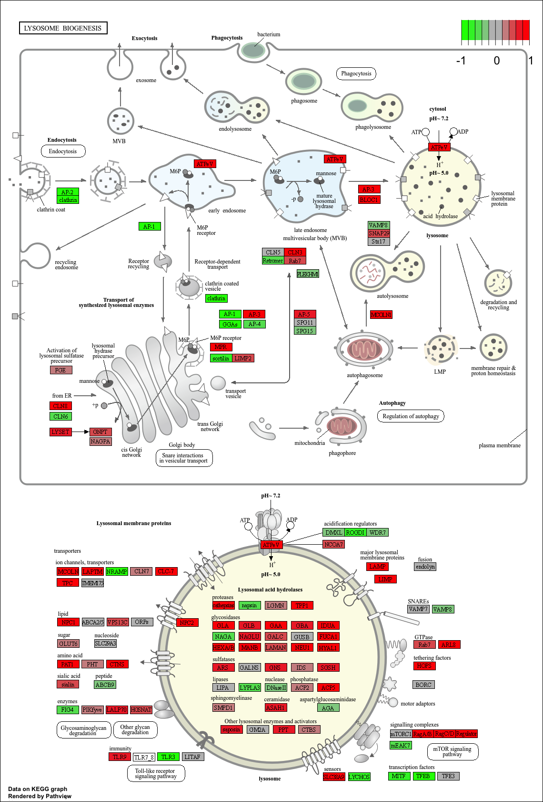
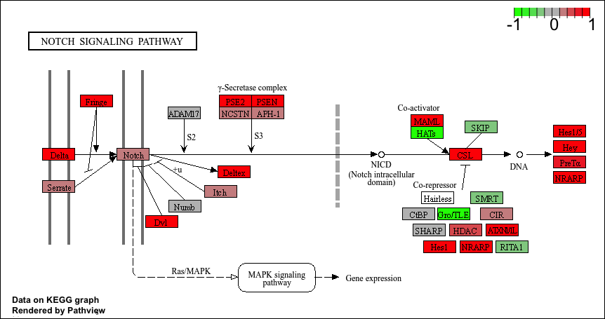

## Background 

Analysis of high-throughput biological data typically yields a list of genes or proteins requiring further interpretation - for example the ranked lists of differentially expressed genes we have been generating from our RNA-seq analysis to date.

Our intention is typically to use such lists to gain novel insights about genes and proteins that may have roles in a given phenomenon, phenotype or disease progression. However, in many cases these 'raw' gene lists are challenging to interpret due to their large size and lack of useful annotations. Hence, our expensively assembled gene lists often fail to convey the full degree of possible insight about the condition being studied.

Pathway analysis (also known as gene set analysis or over-representation analysis), aims to reduce the complexity of interpreting gene lists via mapping the listed genes to known (i.e. annotated) biological pathways, processes and functions.

## Data Import 

Read counts and meatdata CSV files 

```{r, message = FALSE}
library(DESeq2) 
```

```{r}
# Load our data files 
metaFile <- "GSE37704_metadata.csv"
countFile <- "GSE37704_featurecounts.csv"

# Import metadata and take a peek
colData = read.csv(metaFile, row.names=1)
head(colData)
```

```{r}
# Import countdata
countData = read.csv(countFile, row.names=1)
head(countData) 
```

## Sanity check 

> Q. Complete the code below to remove the troublesome first column from countData 

```{r}
# Note we need to remove the odd first $length col
countData <- as.matrix(countData[, -1])
head(countData) 
```

> Q. Complete the code below to filter countData to exclude genes (i.e. rows) where we have 0 read count across all samples (i.e. columns). 

```{r}
# Filter count data where you have 0 read count across all samples.
countData = countData[rowSums(countData) > 0, ]
head(countData) 

```
## Setup DESeq object 

```{r}
dds = DESeqDataSetFromMatrix(countData=countData,
                             colData=colData,
                             design=~condition)
dds = DESeq(dds) 

dds 
```


```{r}
res = results(dds) 
```

> Q. Call the summary() function on your results to get a sense of how many genes are up or down-regulated at the default 0.1 p-value cutoff. 

```{r}
#Calling the summary() function 
summary(res)  
```

## Run DESeq analysis pipeline 


## Extract the results 

Big table with log2 fold changes and p-values 


## Data Viz 

Volcano plot 

```{r}
library(ggplot2)

ggplot(res) +
  aes(log2FoldChange, -log(padj)) +
  geom_point() 
```

> Q. Improve this plot by completing the below code, which adds color, axis labels and cutoff lines: 

```{r}
# Make a color vector for all genes
mycols <- rep("gray", nrow(res)) 

# Color blue the genes with fold change above 2
mycols[ abs(res$log2FoldChange) > 2 ] <- "blue"

# Color gray those with adjusted p-value more than 0.01
mycols[ res$padj > 0.01 ] <- "gray"

```


```{r}

ggplot(res) +
  aes(log2FoldChange, -log(padj)) +
  geom_point(col = mycols) +
  xlab("Log2(FoldChange)") +
  ylab("-Log(P-value)") +
  geom_vline(xintercept = c(-2,+2), col = "red") +
  geom_hline(yintercept = -log(0.05), col = "red") 
```

## Add Annotation data 

Add a gene symbol and entrez ids 

> Q. Use the mapIDs() function multiple times to add SYMBOL, ENTREZID and GENENAME annotation to our results by completing the code below. 

```{r}

# Use mapIDs() function 

library("AnnotationDbi")
library("org.Hs.eg.db")

columns(org.Hs.eg.db)

res$symbol = mapIds(org.Hs.eg.db,
                    keys=row.names(res), 
                    keytype="ENSEMBL",
                    column="SYMBOL",
                    multiVals="first")

res$entrez = mapIds(org.Hs.eg.db,
                    keys=row.names(res),
                    keytype="ENSEMBL",
                    column="ENTREZID",
                    multiVals="first")

res$name = mapIds(org.Hs.eg.db,
                    keys=row.names(res),
                    keytype="ENSEMBL",
                    column="GENENAME",
                    multiVals="first")

head(res, 10) 
```


> Q. Finally for this section let's reorder these results by adjusted p-value and save them to a CSV file in your current project directory. 

```{r} 
# Reorder these 
res = res[order(res$pvalue),]
write.csv(res, file="deseq_results.csv") 
```


## Pathway analysis 

```{r}
library(pathview)
library(gage)
library(gageData)

data(kegg.sets.hs)
data(sigmet.idx.hs)

# Focus on signaling and metabolic pathways only
kegg.sets.hs = kegg.sets.hs[sigmet.idx.hs]

# Examine the first 3 pathways
head(kegg.sets.hs, 3) 
```


```{r}
foldchanges = res$log2FoldChange
names(foldchanges) = res$entrez
head(foldchanges) 
```

```{r}
# Get the results
keggres = gage(foldchanges, gsets=kegg.sets.hs) 
```


```{r}
attributes(keggres) 
```

```{r}
# Look at the first few down (less) pathways
head(keggres$less) 
```


```{r}
pathview(gene.data=foldchanges, pathway.id="hsa04110") 
```

  

```{r}
# A different PDF based output of the same data
pathview(gene.data=foldchanges, pathway.id="hsa04110", kegg.native=FALSE) 
```


```{r}
## Focus on top 5 upregulated pathways here for demo purposes only
keggrespathways <- rownames(keggres$greater)[1:5]

# Extract the 8 character long IDs part of each string
keggresids = substr(keggrespathways, start=1, stop=8)
keggresids 
```


```{r}
pathview(gene.data=foldchanges, pathway.id=keggresids, species="hsa") 
```

 

 

 

 

 

> Q. Can you do the same procedure as above to plot the pathview figures for the top 5 down-regulated pathways? 

Just swap greater for less. The answer is below: 

```{r}
# Focus on top 5 downregulated pathways
keggrespathways_down <- rownames(keggres$less)[1:5]

# Extract the 8 character long IDs part of each string
keggresids_down = substr(keggrespathways_down, start=1, stop=8)
keggresids_down

# Plot pathview figures for top 5 downregulated pathways
pathview(gene.data=foldchanges, pathway.id=keggresids_down, species="hsa")
```


 

 


## Gene Ontology 

```{r}
data(go.sets.hs)
data(go.subs.hs)

# Focus on Biological Process subset of GO
gobpsets = go.sets.hs[go.subs.hs$BP]

gobpres = gage(foldchanges, gsets=gobpsets)

lapply(gobpres, head) 
```

## REACTOME Analysis 

```{r}
sig_genes <- res[res$padj <= 0.05 & !is.na(res$padj), "symbol"]
print(paste("Total number of significant genes:", length(sig_genes))) 
```


```{r}
write.table(sig_genes, file="significant_genes.txt", row.names=FALSE, col.names=FALSE, quote=FALSE) 
```

> Q: What pathway has the most significant “Entities p-value”? Do the most significant pathways listed match your previous KEGG results? What factors could cause differences between the two methods? 

The pathway that has the most significant "Entities p-value" is Cell Cycle. Both KEGG and Reactome highlight cell cycle and DNA replication/repair related pathways as among the most significantly downregulated, which is consistent with HoxA1 knockdown biology. Other commonly overlapping categories include immune system signaling, gene expression/transcription regulation, and metabolism pathways. Factors that could cause differences between the two methods are database content, pathway granularity, gene coverage, statistical methods, and ID mapping. 


 

## Save our results 

```{r}
write.csv(res, file = "myresults_annotated.csv") 
```


